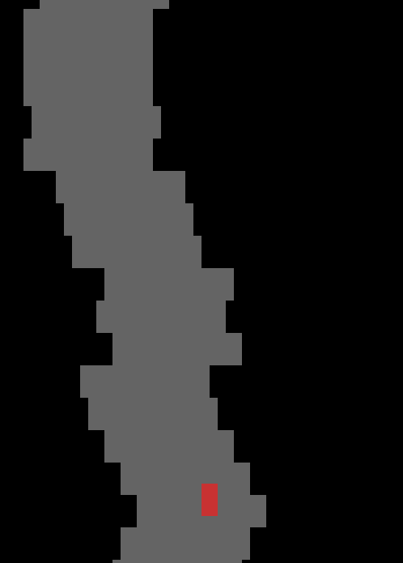

# Procedural Race
Simple car game with a procedural track. It runs infinitely till you crash into the track borders.

## How to play
A: To move left  
D: To move right  
Avoid the track borders (stay on the gray path)  



## Installation and setup

```
git clone https://github.com/ycatsh/procedural-race.git
cd procedural-race
```

### Set up  and activate the virtual environment

Linux:
```
python3 -m venv .venv
source .venv/bin/activate
```

Windows:
```
python -m venv .venv
.venv\Scripts\activate.bat
```

### Download dependencies

```
pip install pygame-ce
```


### Play

```
python main.py
```
